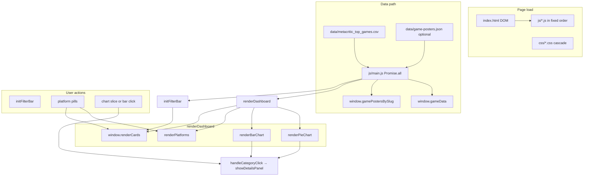

# Code structure & execution flow

This document summarizes how the **Best Games of All Time** visualization loads, which files participate, and how control flows between them. Use it as a map when reading or changing the codebase.

---

## Where execution starts

1. **`index.html`** — The browser loads the page. Static markup defines the layout (hero, chart containers `#chart-left` / `#chart-right`, platform grid, cards region, filter bar, overlays/drawer).

2. **`head`** — **D3.js** loads from the CDN (`d3` global). **Google Fonts** load. **`css/*.css`** loads in a fixed order so later sheets can override earlier ones where selectors overlap.

3. **`body` (end)** — **`js/*.js`** runs **in listed order** (synchronous scripts). Each file attaches globals (`window.*`) and named functions.

4. **After the full document parses** — `DOMContentLoaded` fires. **`js/details-panel.js`** binds the floating info button, overlay, and panel close actions (those elements appear in the HTML **after** the script tags).

---

## JavaScript load order

Order matters: later scripts may assume earlier ones already defined `GENRE_COLORS`, `PLATFORM_DATA`, `handleCategoryClick`, etc.

| Order | File | Primary role |
|------:|------|----------------|
| 1 | `js/constants.js` | `GENRE_COLORS`, `PLATFORM_DATA`, `PLATFORM_GROUP_RANK`, `hexToRgb` |
| 2 | `js/state.js` | Mutable globals (`gameData`, filters, sort, search, pagination) |
| 3 | `js/details-panel.js` | Drawer: drill-down lists, About panel, `handleCategoryClick`, overlay wiring |
| 4 | `js/chart-genre-pie.js` | `renderPieChart` (+ legend); clicks → `handleCategoryClick` |
| 5 | `js/chart-decade-bar.js` | `renderBarChart`; clicks → `handleCategoryClick` |
| 6 | `js/platforms.js` | `renderPlatforms` — platform pills + filter toggle |
| 7 | `js/cards.js` | `window.renderCards` — grid, posters, pagination, card flip |
| 8 | `js/filters.js` | `initFilterBar` — genre/decade/sort/search |
| 9 | `js/dashboard.js` | `renderDashboard` — orchestrates pie, bar, platforms, cards |
| 10 | **`js/main.js`** | **Entry:** loads CSV + JSON, normalizes rows, calls `renderDashboard` + `initFilterBar`; resize + sticky scroll |

---

## Entry point: `main.js`

`main.js` is the only module that **starts async I/O** and registers **window-level** listeners:

- **`Promise.all`** — Fetches `data/metacritic_top_games.csv` and `data/game-posters.json` (posters optional; failure yields `{}`).
- After parse — Sets `window.gamePostersBySlug`, builds `window.gameData` (with numeric `Metascore` and `release_year`), then calls **`renderDashboard()`** and **`initFilterBar()`**.
- **`resize`** — If `gameData` is loaded, calls **`renderDashboard()`** (charts and layout reflow).
- **`scroll`** — Toggles `#sticky-bar` visibility based on scroll past the hero.

Paths like `data/...` are relative to the **HTML page URL**, not the script file location.

---

## Orchestration: `renderDashboard`

Defined in `js/dashboard.js`:

```text
renderDashboard()
  → renderPieChart()      // chart-genre-pie.js
  → renderBarChart()      // chart-decade-bar.js
  → renderPlatforms()     // platforms.js
  → window.renderCards()  // cards.js
```

Any code that needs “refresh everything after data or viewport changes” should go through this pattern (today, `main.js` does that on load and on resize).

---

## Data & dependencies (who reads what)

| Module | Main inputs | Main outputs / side effects |
|--------|-------------|-----------------------------|
| `constants.js` | — | Shared design mappings on `window` |
| `state.js` | — | Initial filter/sort/pager state |
| `chart-genre-pie.js` | `window.gameData`, `GENRE_COLORS` | DOM under `#chart-left` |
| `chart-decade-bar.js` | `window.gameData` | DOM under `#chart-right` |
| `platforms.js` | `PLATFORM_*`, `window.activePlatform` | `#platform-grid`; updates filter + `renderCards` |
| `cards.js` | `gameData`, filters, `gamePostersBySlug`, `PLATFORM_DATA`, `GENRE_COLORS` | `#cards-grid`, `#cards-pagination` |
| `filters.js` | `GENRE_COLORS`, `window.gameData` | Dropdowns/search → state updates → `renderCards` |
| `details-panel.js` | `window.gameData` | `#details-panel`, `#panel-overlay`; `showDetailsPanel`, About HTML |

---

## Flow diagram



---

## CSS layout (`css/`)

Styles are split by concern. **Load order in `index.html` matches the former monolithic `style.css` + `cards.css` cascade** — do not reorder casually; `#cards-grid` in `section-ranking-shell.css` is intentionally superseded by `game-cards.css`.

| Area | Files (conceptually) |
|------|----------------------|
| Tokens & base | `tokens.css` |
| Hero & charts chrome | `hero.css`, `charts.css` |
| Sticky nav | `sticky-bar.css` |
| Floating UI | `floating-info.css`, `modal.css` |
| Ranking section shell | `section-ranking-shell.css`, `dashboard-shell.css` |
| Drawer | `details-panel.css` |
| Filters & platforms | `filters.css`, `platforms.css` |
| Cards | `game-cards.css`, `game-card-back.css`, `cards-pagination.css` |

---

## One-line summary

The HTML shell is static; scripts register globals; **`main.js`** loads and normalizes data, then **`renderDashboard`** redraws charts, platform pills, and cards, while **filters and platform clicks** only update shared state and call **`renderCards`**, and **chart clicks** open the side panel via **`details-panel.js`**.
